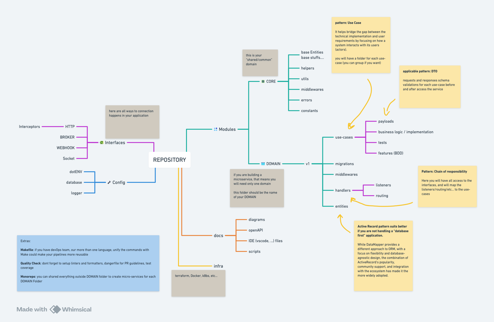

# A Scalable Approach to Software Architecture

This a example (not functional) of approach for software architecture in Typescript

Read the article: [click here](https://natamoliveira.medium.com/a-scalable-approach-to-software-architecture-6eaf7d23f2aa)

I have a private repository as starter-kit (functional), talk to me!
